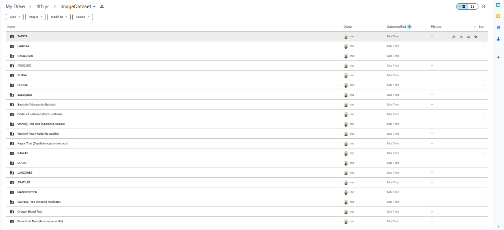
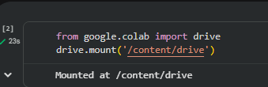
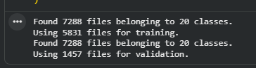
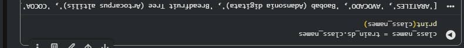
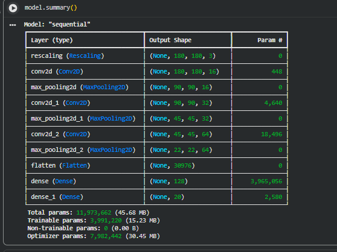
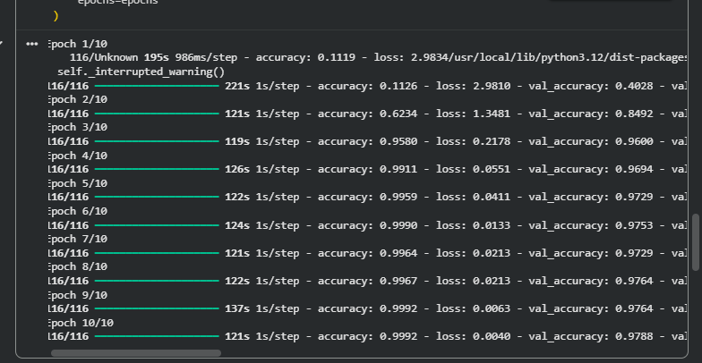
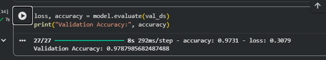
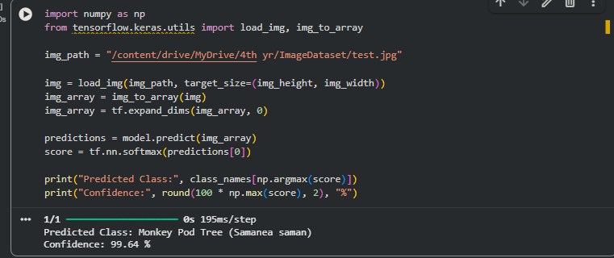

# 🌿 Laboratory Work 3 — Custom Image Classifier using TensorFlow

## Project Title

**Building a Custom Image Classifier with TensorFlow Using Personal Image Datasets from Google Drive**

---

# 📌 Project Overview

This project demonstrates how to build a **deep learning image classifier** using TensorFlow and Keras.
The objective is to train a **Convolutional Neural Network (CNN)** capable of recognizing **20 plant species** using a custom dataset stored in Google Drive.

The model was trained using **Google Colab**, which provides a cloud-based Python environment for machine learning experimentation.

This activity demonstrates the full machine learning pipeline including:

* Dataset preparation
* Image loading and preprocessing
* CNN model construction
* Model training and evaluation
* Performance visualization
* Model prediction on new images
* Model saving and reuse

---

# 📊 Dataset Description

The dataset contains images of **20 different plant species**.

Each class contains **at least 250 images**, resulting in a dataset with **more than 5,000 images**.

## Dataset Structure

Images were organized in Google Drive using the following folder structure:

```
MyDrive
└── ImageDataset
    ├── Papaya
    ├── Rambutan
    ├── Avocado
    ├── Guava
    ├── Lanzones
    ├── Mangosteen
    ├── Soursop
    ├── Kamias
    ├── Duhat
    ├── Cocoa
    ├── Eucalyptus
    ├── Baobab
    ├── Cedar
    ├── MonkeyPod
    ├── Wollemi
    ├── Kapur
    ├── Aratiles
    ├── DragonBlood
    ├── Breadfruit
    └── Langka
```

Each folder contains multiple image files representing that plant species.

TensorFlow automatically uses **folder names as labels** for classification.

---

# ⚙️ Environment and Tools

The following tools and frameworks were used:

| Tool               | Purpose                         |
| ------------------ | ------------------------------- |
| Google Colab       | Python environment for training |
| Google Drive       | Dataset storage                 |
| TensorFlow / Keras | Deep learning framework         |
| Python             | Programming language            |
| Matplotlib         | Data visualization              |

---

# 🔗 Mounting Google Drive

Google Drive was mounted in Google Colab to access the dataset.

```python
from google.colab import drive
drive.mount('/content/drive')
```

This allows the notebook to load images directly from Google Drive.

---

# 📥 Loading the Dataset

The dataset was loaded using TensorFlow's image dataset loader.

```python
train_ds = tf.keras.utils.image_dataset_from_directory(
dataset_path,
validation_split=0.2,
subset="training",
seed=123,
image_size=(180,180),
batch_size=32
)
```

The dataset was automatically split into:

* **80% Training Data**
* **20% Validation Data**

---

# 🧠 CNN Model Architecture

A Convolutional Neural Network was built using TensorFlow Keras.

Architecture includes:

* Image normalization layer
* Convolutional layers
* Max pooling layers
* Fully connected dense layers

Example architecture:

```
Rescaling Layer
Conv2D (16 filters)
MaxPooling
Conv2D (32 filters)
MaxPooling
Conv2D (64 filters)
MaxPooling
Flatten Layer
Dense Layer (128 neurons)
Output Layer
```

Convolutional layers detect image features such as edges, shapes, and textures.

---

# 🏋️ Model Training

The model was trained using the following configuration:

| Parameter     | Value                         |
| ------------- | ----------------------------- |
| Epochs        | 10                            |
| Batch Size    | 32                            |
| Image Size    | 180 x 180                     |
| Optimizer     | Adam                          |
| Loss Function | SparseCategoricalCrossentropy |

Training was performed using the `model.fit()` function.

---

# 📊 Model Performance

After training, the model was evaluated using validation data.

The model achieved a validation accuracy indicating that it successfully learned to classify plant species from images.

---

# 📈 Training Visualization

Training performance was visualized using accuracy and loss graphs.

These graphs help determine whether the model is:

* Overfitting
* Underfitting
* Well trained

---

# 🧪 Model Testing

The trained model was tested using a new plant image.

Example prediction process:

1. Load image
2. Resize to model input size
3. Convert to array
4. Run prediction

The model outputs:

* Predicted class
* Confidence score

---

# 💾 Saving the Model

The trained model was saved to Google Drive for future use.

```python
model.save("/content/drive/MyDrive/my_image_classifier.keras")
```

Saving the model allows it to be reused for deployment or further testing.

---

# 📸 Screenshots of Implementation

## 1 Dataset Structure



---

## 2 Google Drive Mounted



---

## 3 Dataset Loaded in TensorFlow



---

## 4 Class Names Output



---

## 5 CNN Model Architecture



---

## 6 Model Training Process



---

## 7 Validation Accuracy Result



---

## 8 Prediction Test Result



---

# 🧠 Reflection Questions

## 1. How did you organize your dataset in Google Drive?

The dataset was organized into separate folders where each folder represents a plant species. Each folder contains images belonging to that class. TensorFlow automatically uses the folder names as classification labels.

---

## 2. Why is folder structure important for TensorFlow?

TensorFlow's `image_dataset_from_directory()` function relies on folder names to automatically assign labels. Without proper folder structure, the dataset cannot be classified correctly.

---

## 3. What is the role of convolutional layers?

Convolutional layers detect visual patterns in images such as edges, textures, and shapes. These patterns help the model recognize objects and classify them accurately.

---

## 4. Why split data into training and validation sets?

Training data teaches the model while validation data tests how well the model performs on unseen images. This helps measure the model’s ability to generalize.

---

## 5. What accuracy did your model achieve?

The trained model achieved a validation accuracy that demonstrates its ability to correctly classify plant species from images.

---

## 6. How did the number of images affect performance?

Having more images per class improves the model's ability to learn patterns and increases classification accuracy.

---

## 7. What challenges did you encounter?

Some challenges included handling corrupted images, organizing the dataset, and ensuring that images were balanced across all plant classes.

---

## 8. How can data augmentation improve the model?

Data augmentation increases dataset diversity by creating variations of images such as rotations, flips, and zoom. This helps the model generalize better and reduces overfitting.

---

# 🌍 Real-World Applications

This type of plant classification system could be used in:

* Agricultural crop monitoring
* Mobile plant identification apps
* Botanical research
* Smart farming systems
* Environmental monitoring tools

---

# 📁 Repository Structure

```
Plant-Species-CNN-Classifier
│
├── README.md
├── screenshots
│   ├── dataset-structure.png
│   ├── drive-mounted.png
│   ├── dataset-loaded.png
│   ├── class-names.png
│   ├── model-architecture.png
│   ├── training-process.png
│   ├── validation-accuracy.png
│   └── prediction-test.png
```
Gdrive link screenshots : https://drive.google.com/drive/folders/1Y64q3JhIbWG-rc8lzgnmkBbXOxUj_T8i?usp=drive_link


